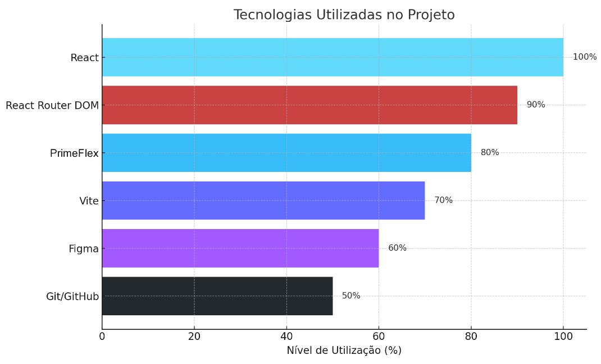

# 🛍️ Projeto Digital Store - Front-end

Este projeto foi desenvolvido como parte do curso de **Desenvolvedor Web Full Stack - Online - 2.0** da **Geração Tech**, com o objetivo de aplicar os conhecimentos adquiridos ao longo do curso utilizando **React** e boas práticas de desenvolvimento front-end. A base do projeto é a [documentação oficial](https://github.com/digitalcollegebr/projeto-digital-store) e o layout disponível no [Figma](https://www.figma.com/design/cfb4F7ZXMFQmvmTn3PKI4z/DRIP-STORE---DIGITAL-COLLEGE?node-id=22-30).

---

## 🎯 Objetivo

Criar uma aplicação web completa com React, implementando as páginas principais e a estrutura visual com base em um projeto de e-commerce. O projeto deve incluir uma página inicial, uma página de listagem de produtos e outra de visualização dos detalhes de um produto.

---

## 🧱 Estrutura do Projeto

### ✅ Requisitos Mínimos
- Implementação dos requisitos obrigatórios listados na [documentação oficial do projeto](https://github.com/digitalcollegebr/projeto-digital-store).

### 📄 Páginas Principais
1. **Página Inicial**
2. **Página de Listagem de Produtos**
3. **Página de Visualização de Produto**

---

## 🧪 Tecnologias Utilizadas

- [React](https://reactjs.org/)
- [React Router DOM](https://reactrouter.com/)
- [PrimeReact](https://primereact.org/)
- [PrimeFlex](https://primeflex.org/)
- [Vite](https://vitejs.dev/)
- [Figma](https://figma.com/)
- [GitHub](https://github.com/)

### 📊 Gráfico de Tecnologias Utilizadas



---

## 💻 Funcionalidades

- Estrutura de navegação com React Router
- Layout responsivo com a biblioteca PrimeFlex
- Sistema de busca com envio automático por URL
- Menu lateral retrátil para smartphones e tablets
- Carrinho com atualização visual em tempo real
- Implementação visual de filtros e ordenação
- Componentização da interface de páginas

---

## 📂 Estrutura de Diretórios Principais

```
├── src/
│   ├── compoments/
│   │   ├── ActionCar.jsx
│   │   ├── ActionRegLog.jsx
│   │   ├── Breadcrumb.jsx
│   │   ├── BuyBox.jsx
│   │   ├── CategoryCard.jsx
│   │   ├── CategoryListing.jsx
│   │   ├── CollectionCard.jsx
│   │   ├── CollectionListing.jsx
│   │   ├── FilterGroup.jsx
│   │   ├── FilterSidebar.jsx
│   │   ├── Footer.jsx
│   │   ├── Gallery.jsx
│   │   ├── Header.jsx
│   │   ├── HeroSlider.jsx
│   │   ├── Layout.jsx
│   │   ├── Logo.jsx
│   │   ├── MenuItems.jsx
│   │   ├── NavSidebar.jsx
│   │   ├── ProductCard.jsx
│   │   ├── ProductFilters.jsx
│   │   ├── ProductListing.jsx
│   │   ├── ProductOptions.jsx
│   │   ├── SearchBar.jsx
│   │   ├── Section.jsx
│   │   └── SortBy.jsx
│   ├── context/
│   │   └── CartContext.jsx
│   ├── data/
│   │   ├── index.js
│   │   └── SiteData.jsx
│   ├── hooks/
│   │   └── useQueryParams.jsx
│   └── pages/
│       ├── ContactPage.jsx
│       ├── HomePage.jsx
│       ├── NotFoundPage.jsx
│       ├── ProductListingPage.jsx
│       ├── ProductViewPage.jsx
│       └── UnderConstructionPage.jsx
├── App.jsx
└── index.jsx
```

---

## 🚀 Como Executar o Projeto Localmente

Projeto final Front-end é executado com React + Vite.

Siga os passos abaixo para clonar, instalar e rodar o projeto em sua máquina:

---

1. Clone o repositório:
   ```bash
   git clone https://github.com/skynetsites/projeto-digital-store.git
   ```

2. Instale as dependências e certifique-se de que o Node.js está instalado:
   ```bash
   npm install
   ```

4. Rode o projeto em ambiente de desenvolvimento:
   ```bash
   npm run dev
   ```
   
5. Você verá um endereço local parecido com:

   VITE v6.3.5 ready in 2933 ms

   ➜  Local:   http://localhost:5173/

Abra no navegador segurando Ctrl e clique no endereço local para visualizar o projeto.

OBS.: Requisitos importantes para execução do projeto:

- Node.js versão 16 ou superior
- npm (ou yarn)
- Navegador moderno

---

## 🌐 Deploys

Link do deploy GitHub:  
[https://skynetsites.github.io/projeto-digital-store](https://skynetsites.github.io/projeto-digital-store)

Link do deploy Vercel:  
[https://projeto-digital-store-ciqz.vercel.app](https://projeto-digital-store-ciqz.vercel.app)

---

## 📎 Observações

- "Ordenar por" e "Filtrar por" estão implementados apenas funcional e visual.
- Projeto realizado para fins de estudo e não representa uma loja real.
